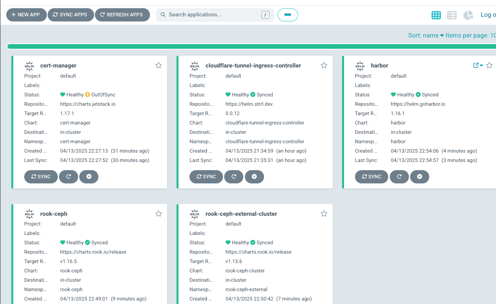
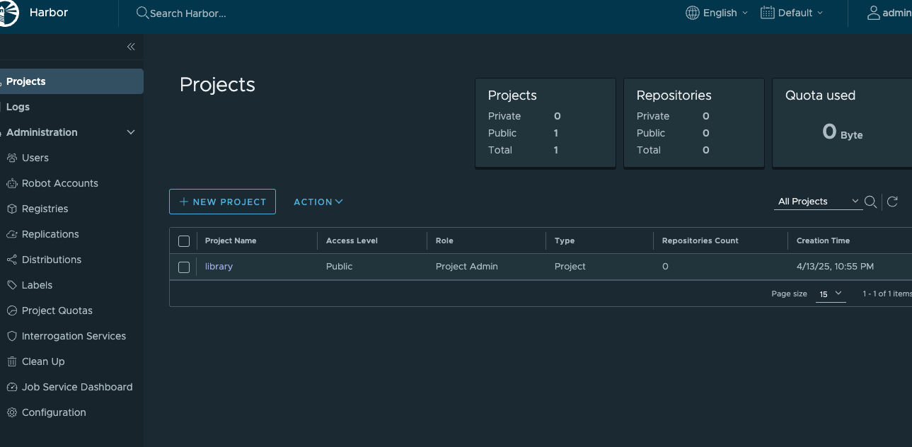

# k8s Cluster on Proxmox 構築手順

## このドキュメントでできること

### 1. ArgoCDを用いたアプリケーションの管理

### 2. Cloudflare Ingress Controllerを用いたサービスの公開

- argocd: https://argocd.example.com
- harbor: https://harbor.example.com

### 3. Rook Cephを用いた永続ストレージの構築

### 4. Harborを用いたプライベートDocker Registryの構築

## 発展

以下のリポジトリとProxmoxを組み合わせることで、VMの作成・削除、構成の自動化が可能になり、自宅に簡易的なクラウド基盤を構築できます。

- [Terraform for Proxmox](https://github.com/AobaIwaki123/Proxmox-Terraform)
- [Ansible](https://github.com/AobaIwaki123/ansible)

## 目次

- [Versions](#versions)
- [0. 前準備](#0-前準備)
  - [1. asdfをインストール](#1-asdfをインストール)
  - [2. asdf pluginの追加](#2-asdf-pluginの追加)
- [k0sctlでk8sクラスターを構築](#k0sctlでk8sクラスターを構築)
- [1. ArgoCDのセットアップ](#1-argocdのセットアップ)
- [2. Cloudflare Ingress Controllerのセットアップ](#2-cloudflare-ingress-controllerのセットアップ)
- [1'. ArgoCDの本セットアップ](#1-argocdの本セットアップ)
- [3. Rook Cephを用いたPVCの構築](#3-rook-cephを用いたpvcの構築)
- [4. Cert Managerのセットアップ](#4-cert-managerのセットアップ)
- [5. Harborのセットアップ](#5-harborのセットアップ)
- [Minioのセットアップ (任意)](#minioのセットアップ-任意)
- [Nginx Ingress Controllerのセットアップ (任意)](#nginx-ingress-controllerのセットアップ-任意)
- [参考](#参考)

## Versions

- asdf: v0.16.6
- k0sctl: v0.23.0
- k9s: v0.40.10
- helm: 3.17.2
- kubectl: 1.32.3
- argocd: 2.14.7

## 0. 前準備

### 1. asdfをインストール
  
[手順](docs/0-asdf/README.md)

### 2. asdf pluginの追加

[手順](docs/0-asdf/README.md)

それ以外の上記[Versions](#versions)に記載のツールをasdf pluginを用いてインストール

## k0sctlでk8sクラスターを構築

1. k0sctl.ymlの作成 (`k0sctl init > k0ctl.yml`)
2. k0sctl.ymlの適用 (`k0sctl apply --config k0sctl.yml`)
3. kube configの取得 (`k0sctl kubeconfig > ~/.kube/config`)

## 1. ArgoCDのセットアップ

NodePortで一旦公開します。

[手順](docs/1-argocd/README.md)

## 2. Cloudflare Ingress Controllerのセットアップ

CloudflareのAPIを用いて、CloudflareのDNSを自動的に更新するIngress Controllerです。
これを用いることでどんなサービスもSSL化して公開することができます。

[手順](docs/2-cloudflare-ingress-controller/README.md)

## 1'. ArgoCDの本セットアップ

ArgoCD上にCloudflare Ingress Controllerをセットアップした後、Cloudflare Tunnel経由で公開します。

[手順](docs/1-argocd/README.md)

## 3. Rook Cephを用いたPVCの構築

[手順](docs/3-rook-ceph-pvc/README.md)

## 4. Cert Managerのセットアップ

Let's Encrypt + cert-manager + Cloudflare DNSで自動的に正式な証明書を発行します

[手順](docs/4-cert-manager/README.md)

## 5. Harborのセットアップ

[手順](docs/5-harbor/README.md)

## Minioのセットアップ (任意)

[手順](docs/minio/README.md)

## Nginx Ingress Controllerのセットアップ (任意)

[手順](docs/nginx/README.md)
