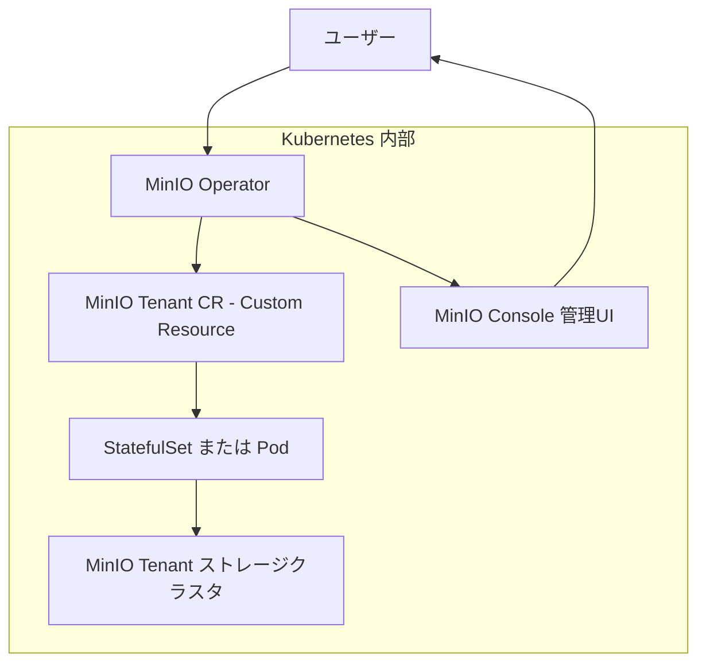

# Install Minio


## 1. Minio Operatorをインストール

```sh
$ kubectl create ns minio-operator
```

### 1-1. Helmを使う場合

```sh
$ helm repo add minio https://operator.min.io/
$ helm repo update
```

```sh
$ helm install \
  --namespace minio-operator \
  operator minio-operator/operator
```

### 1-2. ArgoCDを使う場合

```sh
$ argocd app create --file apps/minio-operator.yaml
```

## 2. Minio Tenantを作成

```sh
$ kubectl create ns minio-tenant
```

使用したいStorageClassをデフォルトに設定しておく (TODO: StorageClass作成時点でやる方法を今度調べる)  
以下はCephのStorageClassをデフォルトに設定する例

```sh
$ kubectl patch storageclass ceph-rbd \
  -p '{"metadata": {"annotations":{"storageclass.kubernetes.io/is-default-class":"true"}}}'
```

```sh
$ kubectl get sc
# DefaultになっていればOK
```

### 2-1. Helmを使う場合

```sh
$ helm install \
  --namespace minio-tenant \
  --values values.yaml \
  TENANT-NAME minio-operator/tenant
``` 

### 2-2. ArgoCDを使う場合

```sh
$ argocd app create --file apps/minio-tenant.yaml
```

## 3. Minio Operator と Minio Tenant の関係

### 3-1. Mermaidでの関係図



了解しました。以下に **簡潔版の解説（Markdown形式）** をまとめます：

---

## 🧩 MinIO Operator と MinIO Tenant CR の関係

### 🔹 MinIO Operator とは？
- Kubernetes 上で MinIO クラスタ（＝Tenant）を管理する **オペレーター**
- ユーザーが作成した設定（CR）をもとに Pod や PVC を自動生成

---

### 🔹 MinIO Tenant CR とは？
- **CR（Custom Resource）** ＝Kubernetes における独自リソース定義  
- MinIO Tenant CR は「どんなMinIOクラスタを作るか」を定義するYAML  
  例：ノード数、ストレージクラス、リソース量、TLS設定など

---

## 🔗 関係性まとめ

| コンポーネント         | 役割                              |
|----------------------|---------------------------------|
| ユーザー               | Tenant CR を作成・適用             |
| MinIO Operator       | CR を監視し、MinIOクラスタを構築    |
| MinIO Tenant CR      | クラスタ構成の仕様書（YAML）       |
| StatefulSet / Pod    | 実際に動く MinIO サーバ群         |
| PVC                  | ストレージ領域（自動生成）         |
| MinIO Console        | 管理用のWeb UI（自動デプロイ）     |

---

## 🔁 処理フロー
1. ユーザーが Tenant CR を作成（`kubectl apply`）
2. Operator が内容を読み取り、Pod や PVC を作成
3. MinIO クラスタが起動
4. Console 経由で管理可能

